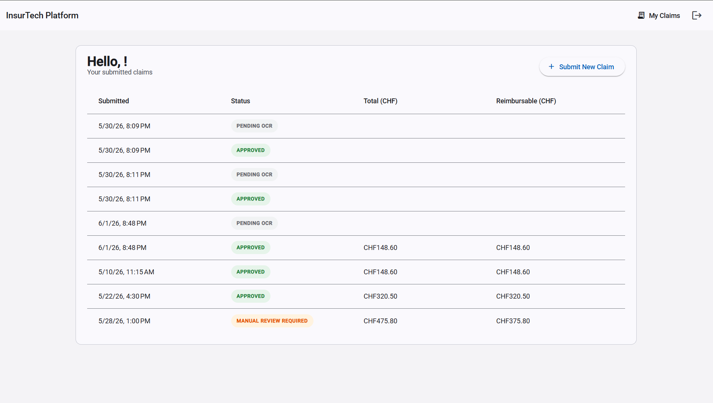
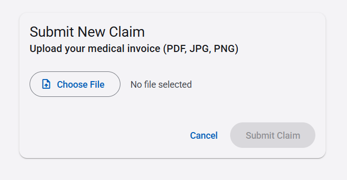
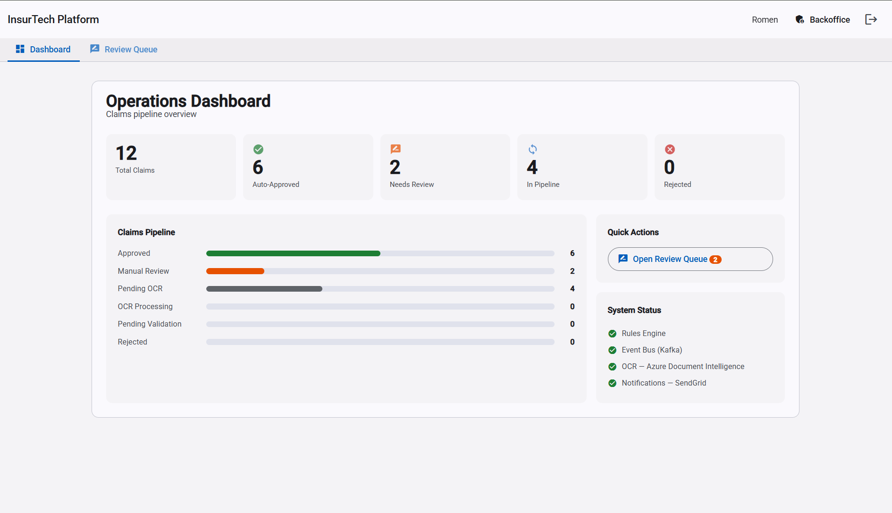
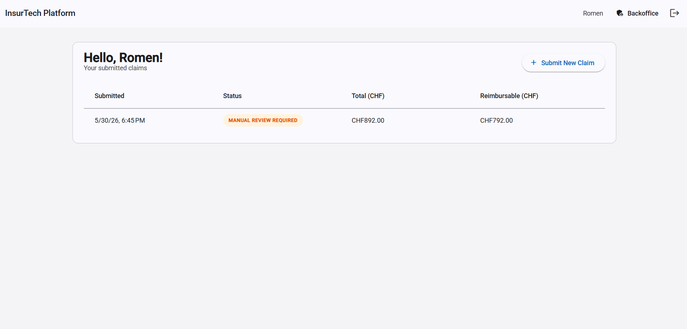
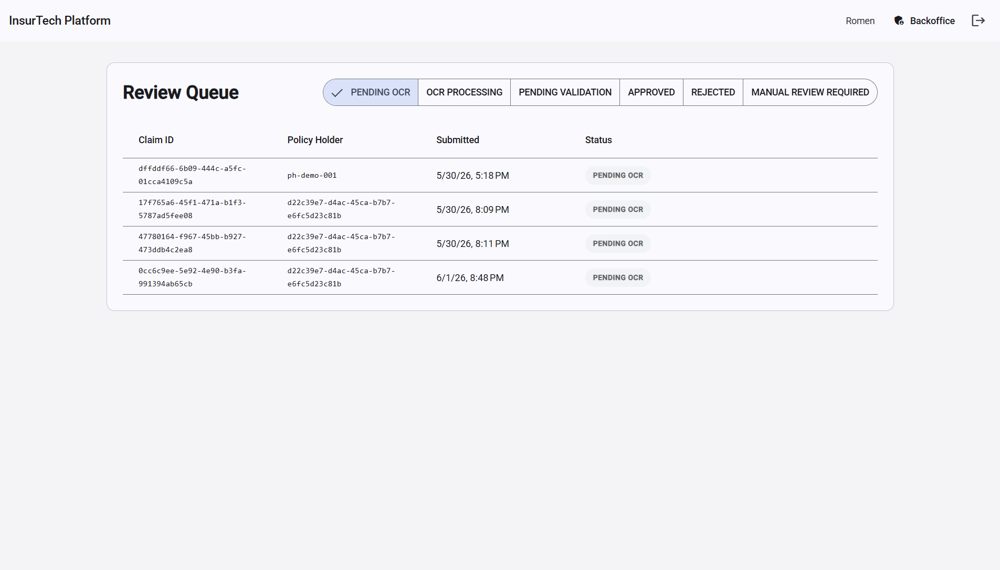
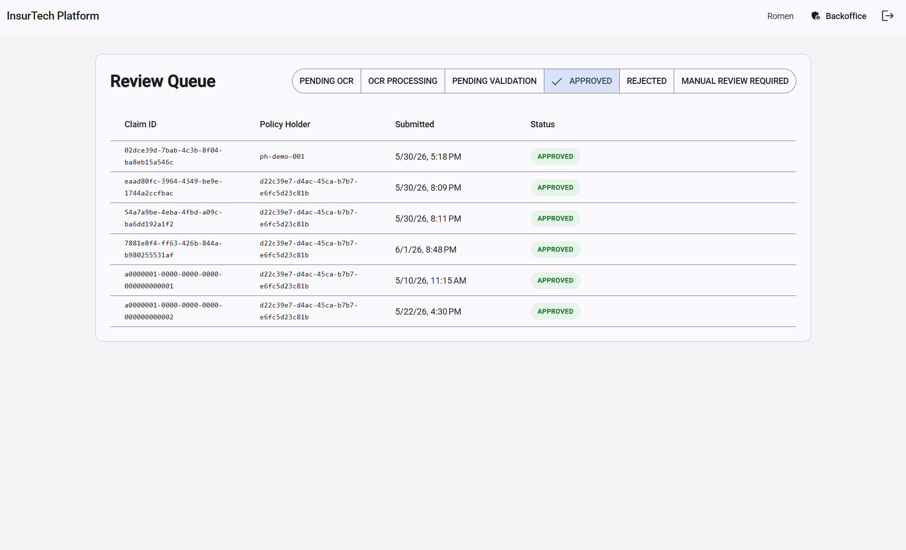
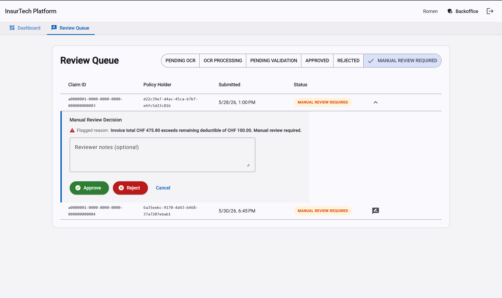

<p align="center">
  
</p>

# InsurTech Claims Platform

[](https://github.com/Goncalves95/InsurTech-Project/actions/workflows/ci.yml)
[](https://openjdk.org/projects/jdk/21/)
[](https://spring.io/projects/spring-boot)
[](https://angular.dev)
[](./LICENSE)

> End-to-end automation of Swiss Krankenkassen medical invoice reimbursement —
> from PDF upload through OCR extraction, Tarmed validation and franchise calculation
> to an instant approval decision, with human review only where rules flag an exception.

---

## The Problem

Swiss health insurers handle **millions of medical invoices per year**. Each document
must be checked against Tarmed/Tardoc billing codes, the insured's annual franchise
(deductible), and policy coverage limits. Done manually, this process is:

| Challenge | Business impact |
|---|---|
| **Specialist knowledge required** | High staffing cost; hard to scale during volume peaks |
| **Error-prone franchise calculation** | Over- and under-payments; compliance risk |
| **Days-long processing cycles** | Poor policyholder experience; churn risk |
| **No structured audit trail** | FADP / nDSG compliance gaps |
| **All claims need human eyes** | Bottleneck even for routine, clearly valid invoices |

---

## The Solution

This platform automates the full pipeline. The rules engine approves straightforward
claims in seconds and routes only genuine exceptions to reviewers:

| What the platform does | Result |
|---|---|
| OCR extraction of Tarmed codes, amounts and provider data | No manual data entry |
| Automated franchise & reimbursable amount calculation | Zero arithmetic errors |
| Strategy-based rules engine (deductible, coverage limits, code whitelist) | Consistent, auditable decisions |
| Auto-approval for clean invoices; review queue for flagged ones | Reviewers focus only where needed |
| Immutable event log via Spring Modulith + Kafka | Full FADP-compliant audit trail |
| Email notifications to policyholders on every decision | Instant, transparent communication |

---

## Table of Contents

- [Overview](#overview)
- [Screenshots](#screenshots)
- [System Architecture](#system-architecture)
- [Tech Stack](#tech-stack)
- [Project Structure](#project-structure)
- [Getting Started](#getting-started)
- [Running Tests](#running-tests)
- [API Reference](#api-reference)
- [Security & Compliance](#security--compliance)
- [Design Patterns](#design-patterns)
- [Roadmap](#roadmap)
- [License](#license)
- [Author](#author)

---

## Overview

Platform capabilities at a glance:

| Capability | Description |
|---|---|
| **Invoice ingestion** | Customers submit PDF/image invoices via a secure portal |
| **OCR extraction** | Azure Document Intelligence extracts amounts, Tarmed codes, provider details |
| **Rules engine** | Strategy-based validator checks franchise, coverage limits and Tarmed codes; computes CHF deductible and reimbursable amounts per policy |
| **Event-driven flow** | Kafka decouples each processing stage; at-least-once delivery guaranteed |
| **Backoffice dashboard** | Claims flagged for manual review appear in a role-gated queue |
| **Audit trail** | Every state transition is timestamped and user-stamped via JPA Auditing |
| **Security** | OAuth2/OIDC with Keycloak, PKCE for SPAs, role-scoped endpoints |
| **Email notifications** | SendGrid dispatches approval/review notifications after every decision |

---

## Screenshots

### Customer Portal — My Claims
> Policy holder view: submitted invoices with CHF reimbursement amounts and colour-coded status chips.



### Submit a New Claim
> PDF invoice upload form — the OCR + validation pipeline triggers automatically on submission.



### Backoffice — Operations Dashboard
> Landing page for reviewers: real-time stat cards (total / auto-approved / needs review / in-pipeline / rejected), a claims pipeline bar chart across all 6 states, quick access to the review queue with a pending badge, and system status indicators.



### Backoffice — Review Queue
> Role-gated reviewer dashboard showing all claims. The button-toggle filter switches between pipeline states.



### Backoffice — Review Queue (PENDING OCR)
> Same dashboard filtered to PENDING OCR — shows claims awaiting document extraction.



### Backoffice — Review Queue (APPROVED)
> Same dashboard filtered to APPROVED — auto-approved claims with CHF reimbursement amounts calculated by the rules engine.



### Backoffice — Inline Approve / Reject
> Expanding a flagged claim reveals the review panel: flagged reason, reviewer notes, and decision buttons.



---

## System Architecture

### Component Overview

```
┌─────────────────────────────────────────────────────────────────────┐
│                         Client Layer                                │
│                                                                     │
│   ┌──────────────────────┐        ┌────────────────────────────┐   │
│   │   Angular 21 SPA     │        │     Keycloak 26 (OIDC)     │   │
│   │   Material 3 UI      │◄──────►│  Realm: insurtech          │   │
│   │   PKCE S256          │        │  Roles: customer, backoffice│  │
│   └──────────┬───────────┘        └────────────────────────────┘   │
│         served by nginx            OAuth2 / ID token (opaque AT)   │
└──────────────┼──────────────────────────────────────────────────────┘
               │ Bearer JWT
               ▼
┌─────────────────────────────────────────────────────────────────────┐
│                     Backend (Spring Boot 3.4)                       │
│                                                                     │
│  ┌──────────┐  ┌──────────┐  ┌──────────┐  ┌────────────────────┐ │
│  │  claim   │  │   ocr    │  │  rules   │  │   notification     │ │
│  │ (API +   │  │(listener │  │(strategy │  │  (listener +       │ │
│  │ lifecycle│  │+ adapter)│  │ engine)  │  │   adapter)         │ │
│  └────┬─────┘  └────┬─────┘  └────┬─────┘  └──────────┬─────────┘ │
│       │             │              │                   │            │
│  └────────────────────────────────────────────────────┘            │
│                    shared (exceptions, audit, config)               │
└──────────┬──────────────────────────┬──────────────────────────────┘
           │                          │
     ┌─────▼──────┐          ┌────────▼────────┐
     │PostgreSQL 16│          │  Apache Kafka   │
     │ + Liquibase │          │  (KRaft mode)   │
     └─────────────┘          └─────────────────┘
```

### Claim Processing Pipeline

```
POST /api/v1/claims
        │
        ▼
ClaimApplicationService ──► status: PENDING_OCR
        │
        └──► DocumentUploadedEvent (Kafka)
                        │
                        ▼
               OcrProcessingService ──► status: OCR_PROCESSING
                        │
                        └──► DataExtractedEvent (Kafka)
                                        │
                                        ▼
                             ClaimValidationService ──► runs all ValidationStrategy beans
                                        │
                          ┌─────────────┴─────────────┐
                          │                           │
                   APPROVED ◄──────────     ──────────► MANUAL_REVIEW
                          │                           │
               ClaimApprovedEvent          ManualReviewRequiredEvent
                          │                           │
                          └──────────┬────────────────┘
                                     ▼
                            NotificationService
                         (SendGrid email dispatch)
```

Spring Modulith's **event publication log** persists every event before dispatch.
If the process restarts mid-pipeline, incomplete events are replayed automatically —
no claim is silently dropped.

---

## Tech Stack

### Backend

| Layer | Technology | Version |
|---|---|---|
| Language | Java | 21 |
| Framework | Spring Boot | 3.4 |
| Architecture | Spring Modulith (modular monolith) | 1.3 |
| Persistence | PostgreSQL + Spring Data JPA | 16 |
| Migrations | Liquibase | 4.30 |
| Messaging | Apache Kafka (KRaft, no ZooKeeper) | 3.7 |
| Security | Spring Security OAuth2 Resource Server | — |
| Identity Provider | Keycloak | 26 |
| OCR | Azure Document Intelligence (prebuilt-invoice) | 4.1 |
| Blob storage | Azure Blob Storage | 12.29 |
| Email | SendGrid Java SDK | 4.10 |
| API Docs | SpringDoc OpenAPI / Swagger UI | 2.7 |
| Build | Maven | 3.9 |
| Tests | JUnit 5 + Mockito + AssertJ + TestContainers | — |
| Coverage | JaCoCo (≥ 70% line coverage enforced in CI) | — |

### Frontend

| Layer | Technology | Version |
|---|---|---|
| Framework | Angular (standalone, signals-based) | 21.2 |
| UI Library | Angular Material (M3, azure-blue theme) | 21.2 |
| Auth | keycloak-js (PKCE S256) | 26.2 |
| HTTP | Angular HttpClient + functional interceptor | — |
| Reactive state | Angular Signals (`signal`, `computed`) | — |
| Build tool | esbuild (`@angular/build:application`) | — |
| Unit tests | Vitest + Angular Testing Library | 4 / 19 |
| E2E tests | Playwright | 1.60 |
| Coverage | @vitest/coverage-v8 (87%+ statements) | — |
| Server (prod) | nginx 1.27 (Docker multi-stage) | — |
| Language | TypeScript | 5.9 |

### Infrastructure & DevOps

| Component | Technology |
|---|---|
| Containerisation | Docker + Docker Compose (5 services) |
| CI/CD | GitHub Actions — parallel jobs + ci-gate branch protection |
| Code style | Prettier + EditorConfig |

---

## Project Structure

```
InsurTech-Project/
├── .github/
│   └── workflows/
│       └── ci.yml              # Parallel backend + frontend jobs + ci-gate
│
├── backend/                    # Spring Boot modular monolith
│   ├── src/main/java/ch/insurtech/platform/
│   │   ├── claim/              # Claim ingestion, lifecycle, REST API
│   │   ├── ocr/                # OCR extraction (stub + AzureDocumentIntelligenceAdapter)
│   │   ├── rules/              # Strategy-based validation engine
│   │   ├── notification/       # SendGrid email + Keycloak user resolver
│   │   └── shared/             # Exceptions, GlobalExceptionHandler, audit, AzureConfig
│   ├── src/main/resources/
│   │   ├── application.yml
│   │   └── db/changelog/       # Liquibase migrations (V001–V005)
│   ├── src/test/               # Unit tests (*Test.java) + ITs (*IT.java, TestContainers)
│   ├── Dockerfile
│   └── pom.xml
│
├── frontend/                   # Angular 21 SPA
│   ├── src/app/
│   │   ├── core/
│   │   │   ├── auth/           # AuthService (signals), guards, JWT interceptor
│   │   │   └── api/            # ClaimsApiService, Claim model
│   │   ├── shared/
│   │   │   └── status-chip/    # Colour-coded claim status chip component
│   │   └── features/
│   │       ├── portal/         # Customer: my-claims + submit-claim
│   │       └── backoffice/     # Backoffice: review-queue (role-gated)
│   ├── e2e/                    # Playwright end-to-end tests
│   ├── src/environments/       # Dev / prod environment config
│   ├── nginx.conf              # SPA routing + /api/ proxy to backend
│   ├── Dockerfile              # Multi-stage: Node build → nginx serve
│   └── playwright.config.ts
│
├── keycloak/
│   └── insurtech-realm.json    # Realm export: users, client, roles, scopes
│
├── docker-compose.yml          # PostgreSQL + Kafka + Keycloak + Backend + Frontend (nginx)
├── .env.example                # Required environment variables (no secrets)
├── CLAUDE.md                   # AI assistant context for this codebase
├── LICENSE
└── README.md
```

---

## Getting Started

### Prerequisites

| Tool | Minimum version |
|---|---|
| Docker + Docker Compose | 24+ |
| Java JDK | 21 |
| Node.js | 22 LTS |
| npm | 10+ |

### 1 — Clone and configure

```bash
git clone https://github.com/Goncalves95/InsurTech-Project.git
cd InsurTech-Project

cp .env.example .env
# Default values work with docker-compose out of the box for dev mode
```

### 2 — Start infrastructure

```bash
docker-compose up postgres kafka keycloak -d
```

Wait ~15 s for Keycloak to finish its first-boot import of `insurtech-realm.json`.

### 3 — Start the backend

```bash
cd backend

# Windows
.\mvnw.cmd spring-boot:run

# macOS / Linux
./mvnw spring-boot:run
```

API: `http://localhost:8080`  
Swagger UI: `http://localhost:8080/swagger-ui.html`

> **Dev seed data**: on first boot with the `dev` profile, Liquibase automatically
> inserts 4 demo claims (2 APPROVED + 2 MANUAL\_REVIEW\_REQUIRED) for the `customer`
> and `backoffice` test accounts so the UI is immediately populated.

### 4 — Start the frontend

```bash
cd frontend
npm install
npm start          # ng serve — proxies /api/ to localhost:8080
```

App: `http://localhost:4200`

### 5 — Full Docker stack (optional)

```bash
docker-compose up          # builds and starts all 5 services
```

Frontend served by nginx at `http://localhost:4200`

### 6 — Test accounts

| Username | Password | Role |
|---|---|---|
| `customer` | `customer123` | Customer portal |
| `backoffice` | `backoffice123` | Backoffice + customer portal |

---

## Running Tests

### Backend — full verification (unit + integration + coverage)

```bash
cd backend

# Windows
.\mvnw.cmd verify

# macOS / Linux
./mvnw verify
```

- **Unit tests** (`*Test.java`) — Surefire, no Docker required
- **Integration tests** (`*IT.java`) — Failsafe, TestContainers spins up real PostgreSQL + Kafka
- **Modularity tests** — Spring Modulith verifies no module violates declared boundaries
- **JaCoCo** — enforces ≥ 70% line coverage; report at `target/site/jacoco/index.html`

### Frontend — unit tests

```bash
cd frontend

npm test                   # run all tests once
npm run test:coverage      # run with v8 coverage report (87%+ statements)
```

Tests use **Vitest** + **Angular Testing Library** — components are tested as a user
would interact with them, not by inspecting internal class state.

| Test file | What it covers |
|---|---|
| `app.spec.ts` | App shell: toolbar, auth state, brand name |
| `auth.service.spec.ts` | AuthService signals, Keycloak mock, backoffice role |
| `status-chip.spec.ts` | CSS classes and labels for all 6 claim statuses |
| `my-claims.spec.ts` | Loading, error, empty state, session guard, data render |

### Frontend — E2E tests (requires Docker stack)

```bash
cd frontend
npm run e2e        # headless Chromium
npm run e2e:ui     # Playwright interactive UI
```

Set `E2E_USERNAME` + `E2E_PASSWORD` env vars to run the authenticated portal tests.

---

## API Reference

All endpoints require a valid Bearer JWT issued by Keycloak.  
Interactive docs: `http://localhost:8080/swagger-ui.html`

| Method | Endpoint | Description | Required scope |
|---|---|---|---|
| `POST` | `/api/v1/claims` | Submit invoice (`multipart/form-data`: `policyHolderId` + `document`) | any authenticated |
| `GET` | `/api/v1/claims/{claimId}` | Get claim by ID | any authenticated |
| `GET` | `/api/v1/claims?policyHolderId=` | List all claims for a policy holder | any authenticated |
| `GET` | `/api/v1/claims/status/{status}` | List claims by status | `SCOPE_backoffice` |
| `PUT` | `/api/v1/claims/{claimId}/review` | Submit manual review decision (`{"decision":"APPROVE"\|"REJECT","notes":"..."}`) | `SCOPE_backoffice` |

### Claim response fields

| Field | Type | Description |
|---|---|---|
| `id` | UUID | Claim identifier |
| `policyHolderId` | string | Keycloak subject (`idTokenParsed.sub`) |
| `status` | enum | Current lifecycle state |
| `reviewerNote` | string? | Flagged reason (rules engine) or reviewer decision notes |
| `totalAmount` | decimal? | Total invoice amount extracted by OCR (CHF) |
| `deductible` | decimal? | Franchise portion applied to this invoice (CHF) |
| `reimbursableAmount` | decimal? | Amount the insurer reimburses (`totalAmount − deductible`) |
| `submittedAt` | ISO 8601 | Submission timestamp |

### Claim lifecycle states

```
PENDING_OCR → OCR_PROCESSING → PENDING_VALIDATION → APPROVED (auto)
                                                   ↘ REJECTED (auto)
                                                   ↘ MANUAL_REVIEW_REQUIRED
                                                           │
                                                  reviewer action
                                                     ↙         ↘
                                                APPROVED      REJECTED
```

---

## Security & Compliance

### Authentication & Authorisation

- All endpoints protected by Spring Security OAuth2 Resource Server
- JWTs validated against Keycloak's JWKS endpoint on every request
- Role-based access: `SCOPE_backoffice` required for the review queue endpoint
- Angular SPA uses **PKCE with S256** — immune to authorisation code interception
- Tokens refreshed automatically 30 s before expiry (JWT interceptor)
- **Note:** this Keycloak realm issues opaque access tokens; the user subject is
  resolved from the ID token (`idTokenParsed.sub`)

### Data protection

- Error responses never expose internal stack traces (`GlobalExceptionHandler`)
- Every record carries `created_at`, `updated_at`, `created_by`, `updated_by` audit columns
- Secrets loaded from environment variables — never hardcoded, never committed
- Production deployment must reside in a Swiss data centre (`switzerlandnorth`) to
  comply with **FADP / nDSG** (Swiss Federal Act on Data Protection)

---

## Design Patterns

### Hexagonal Architecture (Ports & Adapters)

Each module exposes a `domain/port` interface. Infrastructure adapters implement it
and are selected via Spring `@Profile`. Swapping from stub to production adapter
requires zero changes to domain code.

| Port | Dev adapter | Production adapter (`azure` profile) |
|---|---|---|
| `DocumentStoragePort` | `LocalDocumentStorageAdapter` | `AzureBlobStorageAdapter` ✓ |
| `OcrProviderPort` | `StubOcrProviderAdapter` | `AzureDocumentIntelligenceAdapter` ✓ |
| `NotificationPort` | `StubEmailNotificationAdapter` | `SendGridEmailNotificationAdapter` ✓ |
| `UserEmailResolverPort` | `StubUserEmailResolverAdapter` | `KeycloakAdminUserEmailAdapter` ✓ |
| `PolicyContextPort` | `StubPolicyContextAdapter` | *(roadmap)* |

### Strategy Pattern — Rules Engine

`ClaimValidationService` iterates over all `List<ValidationStrategy>` beans injected
by Spring. Adding a new business rule requires only a new `@Component` — no other
class changes.

Active strategies:
- `DeductibleValidationStrategy` — checks remaining franchise (Selbstbehalt)
- `CoverageAmountValidationStrategy` — checks maximum policy coverage
- `TarmedCodeValidationStrategy` — validates Tarmed code format (`XX.XXXX`)

### Custom Exception Hierarchy

```
InsurTechException (abstract)
├── ResourceNotFoundException
│   └── ClaimNotFoundException
├── ValidationException
├── DuplicateResourceException
└── ExternalServiceException
```

### Modular Monolith (Spring Modulith)

Modules communicate exclusively via:
1. **Public API classes** at the module root package
2. **Domain events** published to Spring's `ApplicationEventPublisher` / Kafka

Internal classes (`*JpaRepository`, `*RepositoryAdapter`, etc.) are package-private
and inaccessible to other modules. `ModularityTests` enforces this at every CI run
and generates PlantUML architecture diagrams to `target/modulith-docs/`.

---

## Roadmap

- [x] Azure Document Intelligence adapter — Tarmed/Tardoc OCR
- [x] Azure Blob Storage adapter — secure document storage
- [x] SendGrid notification adapter — transactional email on claim decision
- [x] Keycloak Admin user resolver — email lookup for notifications
- [x] nginx frontend container in Docker Compose
- [x] Angular Testing Library unit tests (87%+ coverage)
- [x] Playwright E2E test suite
- [x] Backoffice review queue — manual approve/reject with reviewer notes
- [ ] `PolicyManagementServiceAdapter` — live policy lookup (currently stub)
- [ ] SonarQube quality gate in CI
- [ ] Snyk dependency vulnerability scanning in CI
- [ ] Helm chart for Kubernetes deployment (AKS / `switzerlandnorth`)

---

## License

This software is proprietary and all rights are reserved.  
See [LICENSE](./LICENSE) for full terms.

**In summary:** viewing the source code for personal educational reference is
permitted. Any reproduction, distribution, commercial use, or derivative work
requires the author's prior written consent.

For permissions and licensing inquiries: **create@raigonlab.com**

---

## Author

**Fernando Goncalves**  
Full-stack Software Engineer — Java / Spring Boot / Angular  
Portfolio project targeting Swiss Krankenkassen

[](https://github.com/Goncalves95)
[](https://www.linkedin.com/in/fernandojcgoncalves/)
